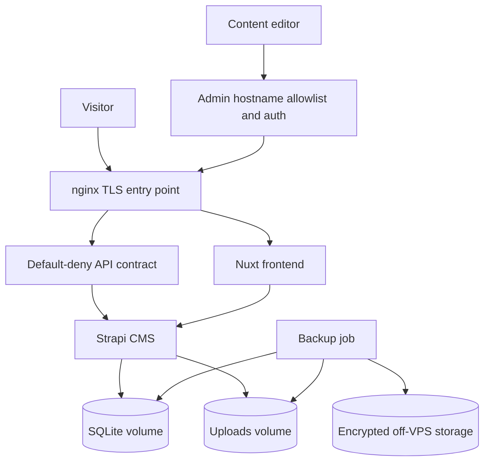
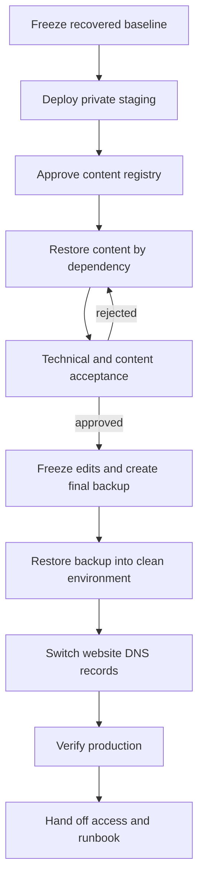

# Nonna Site Recovery - Plan

## Goal Capsule

- **Objective:** Восстановить публичную работу сайта Nonna на новом VPS, перенести сохранённые данные, повторно внести согласованный утраченный контент и обеспечить проверяемое восстановление из внешней резервной копии.
- **Means:** Использовать текущий работающий Docker-стек без обновления основных версий, сначала развернуть его в закрытом staging-режиме, затем наполнить CMS и переключить домен после приёмки (KTD1–KTD4).
- **Authority:** Подтверждённый объём и выбор заказчика имеют приоритет над техническими предположениями.
- **Requirement precedence:** Требования R1–R16 имеют приоритет над техническими решениями.
- **Implementation precedence:** KTD определяют способ реализации требований.
- **Execution profile:** Изменения конфигурации и автоматизации, развёртывание на VPS, перенос данных, операционное наполнение CMS и приёмка.
- **Stop conditions:** Работа или запуск останавливаются при любом из условий:
  - нет неизменяемой копии исходной базы и uploads;
  - заказчик не предоставил VPS или DNS-доступ;
  - наружу опубликованы порты Strapi/Nuxt;
  - staging не принят;
  - финальная внешняя копия не восстановлена до смены DNS.
- **Tail ownership:** Исполнитель отвечает за работы до production-проверки, передачи доступов и инструкции; заказчик после передачи отвечает за оплату VPS, домена и хранилища резервных копий.

---

## Product Contract

### Summary

План восстанавливает сайт из уже проверенного локального Docker-стека, разворачивает его на новом VPS, дополняет CMS только по согласованному реестру утраченного контента и завершает работу внешним резервным копированием с пробным восстановлением.

### Problem Frame

Предыдущий VPS был удалён после окончания оплаченного периода. Актуальная резервная копия удалённого сервера отсутствует, поэтому получить с него последнюю базу данных и uploads невозможно.

В проекте сохранился рабочий снимок SQLite. Последнее изменение контента в нём датировано 10 июня 2025 года. Снимок содержит 31 опубликованную запись, 18 медиаобъектов и 70 физических файлов оригиналов и производных размеров. Все текущие Docker-контейнеры работают локально и проходят healthcheck. Этот снимок является проверяемой исходной точкой, но не доказательством полного соответствия удалённому VPS.

### Actors

- A1. **Заказчик:** владеет аккаунтами VPS и домена, предоставляет материалы, утверждает реестр контента и принимает staging.
- A2. **Исполнитель:** сохраняет исходный снимок, готовит production-конфигурацию, разворачивает сайт, переносит данные, выполняет проверки и передаёт инструкции.
- A3. **Контент-редактор:** вносит согласованные материалы только в staging CMS и фиксирует статус каждой позиции в реестре.

### Requirements

**Preservation and baseline**

- R1. Перед любыми изменениями сохранить две проверенные неизменяемые копии `data.db`, uploads и идентификаторов релизных commit SHA в независимых отказных доменах.
- R2. Зафиксировать машинно-читаемый baseline по каждой записи, локали, связи и медиафайлу, а не только общие количества.
- R3. Обычный `git clone` не считается переносом данных, потому что SQLite и uploads не входят в Git и Docker-образы.

**Production deployment**

- R4. Развернуть текущие версии Strapi, Nuxt, Node и nginx на новом VPS без обновления технологического стека.
- R5. До смены DNS сайт должен работать в закрытом staging-режиме без индексации поисковиками.
- R6. Из интернета доступны nginx на порту 443 для HTTPS, порт 80 только для перенаправления на HTTPS и ограниченный SSH; публичный API работает по положительному списку, а Strapi, Nuxt и все остальные CMS-маршруты закрыты по умолчанию.
- R7. Выпустить сертификат для рабочего домена, включить перенаправление HTTP на HTTPS и настроить автоматическое продление.
- R8. Создать новые production-секреты и минимальный read-only API-токен, затем отозвать все неподтверждённые административные доступы, токены и webhooks из восстановленной базы.

**Content recovery**

- R9. Восстанавливать только позиции из согласованного реестра, потому что полное состояние удалённого VPS невозможно доказать.
- R10. Разделить CMS-контент и статические тексты/изображения, которые хранятся во frontend-коде.
- R11. После первичного импорта единственным источником контента является staging CMS; локальная и серверная базы не редактируются параллельно.
- R12. Наполнять CMS в порядке зависимостей: справочники, паркеты, проекты, затем новости и контакты.
- R13. Русская и английская версии восстанавливаются только при наличии материалов; отсутствие непредоставленного перевода не является техническим дефектом.
- R14. Сохранять прежние URL и slug; при согласованном изменении добавлять redirect.

**Cutover and operations**

- R15. Переключать DNS только после приёмки staging, блокировки редакторских изменений, восстановления финальной копии на чистом окружении и готовности живого fallback или maintenance-страницы.
- R16. Хранить резервные копии вне VPS с append-only доступом от production и считать настройку завершённой только после проверки отдельными restore-учётными данными.

### Key Flows

- F1. **Сохранение и private staging**
  - **Trigger:** Заказчик предоставляет VPS и доступы.
  - **Actors:** A1, A2
  - **Steps:** Исполнитель фиксирует baseline, готовит закрытый production-контур, переносит исходные данные и подтверждает работу контейнеров.
  - **Outcome:** Текущая версия сайта доступна для работ, но ещё не опубликована по основному домену.
  - **Covered by:** R1–R8
- F2. **Восстановление контента**
  - **Trigger:** Заказчик утверждает реестр и предоставляет материалы.
  - **Actors:** A1, A2, A3
  - **Steps:** Контент вносится по зависимостям, затем проверяются локали, связи, URL и медиа.
  - **Outcome:** Каждая позиция реестра имеет подтверждённый статус и согласующего.
  - **Covered by:** R9–R14
- F3. **Публикация и защита данных**
  - **Trigger:** Заказчик принимает staging.
  - **Actors:** A1, A2
  - **Steps:** Изменения контента замораживаются, создаётся финальная копия, эта копия восстанавливается на чистом окружении, затем обновляется DNS и выполняются production-проверки.
  - **Outcome:** Сайт опубликован, а восстановление из внешней копии доказано.
  - **Covered by:** R15, R16

### Acceptance Examples

- AE1. **Baseline survives a fresh deployment**
  - **Covers:** R1–R3
  - **Given:** Новый VPS и пустые Docker volumes.
  - **When:** Исполнитель разворачивает зафиксированный релиз и переносит baseline.
  - **Then:** Доступны не менее 31 исходной записи, 18 медиаобъектов и все связанные upload-файлы.
- AE2. **Missing translation is handled as content scope**
  - **Covers:** R9, R13
  - **Given:** Для записи предоставлена только русская версия.
  - **When:** Выполняется контентная приёмка.
  - **Then:** Русская запись принимается, а отсутствие английской отмечается в реестре и не считается ошибкой сайта.
- AE3. **DNS changes preserve unrelated services**
  - **Covers:** R15
  - **Given:** В DNS есть записи сайта, почты и подтверждений сторонних сервисов.
  - **When:** Выполняется переключение на новый VPS.
  - **Then:** Меняются только записи сайта; MX, TXT, CAA и иные несвязанные записи сохраняются.
- AE4. **Backup is proven usable**
  - **Covers:** R16
  - **Given:** Чистое окружение без рабочей базы и uploads.
  - **When:** Выполняется восстановление только из внешней резервной копии.
  - **Then:** CMS, связи, изображения, API и основные страницы проходят проверку.

### Success Criteria

- После перезагрузки VPS контейнеры автоматически запускаются и становятся healthy.
- Снаружи работают основной домен и `www` по HTTPS, а прямой доступ к портам Strapi и Nuxt закрыт.
- Неизвестные CMS-маршруты, методы, коллекции и query-параметры отклоняются до Strapi; разрешённые frontend-запросы продолжают работать.
- На production присутствуют baseline и все принятые позиции реестра; битых изображений и незаполненных обязательных связей нет.
- Staging не индексируется, а основной домен переключается только после письменной приёмки.
- Финальная внешняя резервная копия успешно восстановлена на чистом окружении до изменения DNS.
- После DNS-конвергенции сайт проходит 24-часовое окно наблюдения без нерешённых критических инцидентов.
- Заказчик получил доступы, инструкцию и уведомления об оплате VPS, домена и backup-хранилища.

### Scope Boundaries

**In scope**

- Production-конфигурация текущего Docker-стека, новый VPS, HTTPS, ограничение доступа и мониторинг.
- Перенос сохранённой SQLite-базы и uploads вне Git.
- Реестр утраченного контента, внесение предоставленных материалов и проверка CMS/статических страниц.
- Внешнее резервное копирование, restore drill и эксплуатационная инструкция.

#### Deferred to Follow-Up Work

- Обновление Strapi 4 до Strapi 5.
- Переход с SQLite на PostgreSQL.
- Обновление Node 18, Nuxt 3 и nginx 1.27 до поддерживаемых веток.
- Перенос uploads в S3-совместимое хранилище с versioning.
- Высокая доступность на нескольких серверах.

**Outside scope**

- Получение данных с удалённого VPS без резервной копии.
- Написание и перевод текстов, профессиональная обработка изображений, редизайн, SEO и новые функции.
- Оплата VPS, домена, внешнего хранилища и других сторонних сервисов.

### Dependencies

- Оплаченный VPS и SSH-доступ, принадлежащие заказчику.
- Доступ к DNS и полный снимок текущих DNS-записей.
- Управление основным, `www` и отдельным административным hostname.
- Материалы и утверждённый реестр контента.
- Внешнее хранилище резервных копий с независимым аккаунтом и оплатой.
- Подтверждение административного доступа или согласие на создание нового администратора.

### Sources

- Локальный запуск и ограничения текущего стека: `DOCKER.md`, `docker-compose.yml`, `prod-config/docker-compose.yml`.
- Зависимости контента: `cms/src/api/parquet/content-types/parquet/schema.json`, `cms/src/api/project/content-types/project/schema.json`.
- Frontend CMS-запросы и статический контент: `nonna.ru/pages/`, `nonna.ru/components/`, `nonna.ru/locales/`, `nonna.ru/public/images/`.
- [Strapi security policy](https://github.com/strapi/strapi/security/policy) and [final Strapi 4 release](https://github.com/strapi/strapi/releases/tag/v4.26.2).
- [Strapi relational-filter data exposure advisory](https://github.com/strapi/strapi/security/advisories/GHSA-rjg2-95x7-8qmx) and [Strapi webhook SSRF advisory](https://github.com/strapi/strapi/security/advisories/GHSA-v8wj-f5c7-pvxf).
- [Node.js release status](https://nodejs.org/en/about/previous-releases) and [Nuxt lifecycle](https://nuxt.com/docs/3.x/community/roadmap).
- [nginx security advisories](https://nginx.org/en/security_advisories.html) and [Docker port publishing](https://docs.docker.com/engine/network/port-publishing/).
- [SQLite backup guidance](https://www.sqlite.org/backup.html) and [Docker volumes](https://docs.docker.com/engine/storage/volumes/).

---

## Planning Contract

### Key Technical Decisions

- KTD1. **Publish the current application stack.** (session-settled: user-directed — chosen over partial or full dependency modernization: the user selected the fastest restoration path after the EOL and known-vulnerability risks were presented.) Implements R4. This accepts residual dependency risk but does not authorize unrestricted CMS or API exposure.
- KTD2. **Preserve and identify the recovered snapshot before all writes.** Stop CMS writes, verify SQLite integrity and foreign keys, then create one read-only local copy and one encrypted off-device copy. A JSON manifest identifies every record, relation and media checksum so equal total counts cannot hide replacement or corruption. Implements R1–R3.
- KTD3. **Promote private staging in place.** Staging uses the final production volumes on the new VPS and becomes production by access-mode and DNS changes, without a second data import. Checkpoints protect each accepted content layer. Implements R5, R9–R13.
- KTD4. **Keep every service in Docker behind default-deny routing.** Production Compose exposes only nginx on port 443 for TLS and port 80 for HTTP-to-HTTPS redirects. The main hostname routes the frontend, allowed API and read-only uploads; a separate administrative hostname adds an allowlist plus nginx authentication before any CMS management route. Implements R6, R7.
- KTD5. **Allow only the frontend API contract.** The existing Nuxt server proxy in `nonna.ru/server/routes/api/[...].ts` accepts only GET/HEAD for `/contacts`, `/site-news-many`, `/parquets`, `/woods`, `/projects`, `/type-of-properties` and the existing detail routes for parquets, projects and news. It accepts only `locale=ru|en` and the literal `populate=*`, caps collection responses at 100 records and rejects client pagination overrides, filters, nested/bracketed parameters and unknown paths. Public Strapi roles have no permissions; the server token has only required `find`/`findOne` grants, and authentication, upload and plugin APIs are never proxied. Implements R6, R8.
- KTD6. **Issue replacement credentials, then revoke recovered access before public exposure.** Inventory all admin users, roles, API/transfer tokens, auth providers and webhooks; rotate every Strapi secret and issue one minimal read-only token, then disable unconfirmed entries, force confirmed administrator password changes and remove superseded tokens and webhooks. Implements R8.
- KTD7. **Publish backups only after end-to-end verification.** During a short maintenance window, the job proves the writer is stopped, builds and reads a consistent database/uploads archive, encrypts it, uploads it under a temporary name, verifies the remote checksum and publishes the success manifest last. Production credentials can append but cannot replace or delete backup generations; retention is enforced by the external storage lifecycle under a separate owner account that is absent from the VPS. Implements R16.
- KTD8. **Pin code, images and data as one release.** The release manifest contains the root and frontend submodule SHAs, built-image digests and the external backup generation ID. A recoverable image artifact is stored outside the VPS so mutable tags or a missing registry do not block disaster recovery. Implements R1, R3.

### High-Level Technical Design





### Sequencing

1. U1 establishes the immutable baseline and measurable content inventory.
2. U2 prepares the production Docker and security boundary.
3. U3 backup work and U4 private-staging deployment proceed in parallel after U2.
4. U5 starts only after both staging and recoverability are proven, then restores content in the staging source of truth.
5. U6 performs acceptance, DNS cutover, monitoring and handoff.

### Risks and Mitigations

| Risk | Impact | Mitigation |
|---|---|---|
| Current Strapi, Node and Nuxt versions are EOL; Strapi 4.25.1 predates a critical security fix | Compromise or data disclosure after publication | Record accepted risk, expose only nginx, protect management routes, rotate secrets, monitor logs and create a follow-up modernization scope |
| Relational filters reach the vulnerable Strapi Content API through the frontend proxy | Private fields can be disclosed with a read-only token | Enforce the KTD5 positive API contract before Strapi and alert on rejected exploit-shaped queries |
| A recovered administrator, token or webhook remains active | Unauthorized CMS access or server-side requests | Inventory and revoke all recovered access per KTD6; prove old credentials no longer work |
| Exact content from the deleted VPS is unknown | Unbounded manual work and acceptance disputes | Make the approved registry the only completeness contract; price additional items separately |
| SQLite and uploads remain on one VPS | Server loss or corruption removes live data | Daily encrypted off-VPS backup, retention, checksums and quarterly restore drill |
| Compromised production credentials can delete off-VPS backups | Live data and disaster-recovery generations are lost together | Give production append-only access; keep restore/delete credentials outside the VPS and alert on denied deletion attempts |
| Parallel edits create divergent databases | Lost or overwritten content | Make staging CMS the only editable source after baseline import and freeze edits during cutover |
| DNS changes affect mail or verification records | Email or third-party service outage | Snapshot the whole zone and change only website records |
| Existing admin/API credentials are unusable or exposed | Blocked CMS access or unauthorized access | Verify admin access privately and create new production credentials before go-live |
| External video or other integrations are unavailable | Visually incomplete pages despite healthy containers | Inventory and test external dependencies separately from local uploads |

### System-Wide Impact

- **Visitors:** Receive the restored site after staging acceptance; old URLs remain stable where possible.
- **Content editors:** Work only in staging CMS and stop editing during the cutover window.
- **Operations:** Own TLS renewal, storage/inode thresholds, log rotation, health monitoring, security events, missed-backup monitoring and restore drills.
- **Customer:** Owns infrastructure accounts, payment reminders, source materials and final content acceptance.
- **Data lifecycle:** SQLite and uploads are moved outside containers but remain tied to one VPS; the external backup is the disaster-recovery boundary.
- **Launch ownership:** The executor owns go/no-go, triage and rollback through the 24-hour observation window; the customer remains available for DNS decisions.

---

## Output Structure

```text
.env.production.example
DOCKER.md
cms/
  config/
    server.js
docs/recovery/
  acceptance-checklist.md
  baseline-manifest.json
  baseline-manifest.md
  content-inventory.csv
  runbook.md
prod-config/
  certbot/
  backup.example.env
  docker-compose.yml
  nginx.conf
scripts/
  audit-recovery-data.sh
  backup-production.sh
  restore-production.sh
  test-backup-restore.sh
  test-deployment-smoke.sh
  test-docker-recovery.sh
```

---

## Implementation Units

### U1. Freeze and document the recovered baseline

- **Goal:** Protect the current data snapshot and make future content differences measurable.
- **Requirements:** R1–R3
- **Dependencies:** None
- **Files:**
  - Create `docs/recovery/baseline-manifest.md`.
  - Create `docs/recovery/baseline-manifest.json`.
  - Create `scripts/audit-recovery-data.sh`.
  - Extend `scripts/test-docker-recovery.sh` with a data-integrity and manifest-comparison mode.
  - Reference `cms/.tmp/data.db`, `cms/public/uploads/`, and `.gitmodules` without adding ignored runtime data to Git.
- **Approach:**
  1. Stop CMS writes and confirm there is no active SQLite writer or detached WAL state.
  2. Record both repository commit SHAs, database checksum, database timestamp, collection/locale counts and bidirectional media-file reconciliation.
  3. Record each entry's collection, ID, locale, stable key, publication state, significant-field checksum, relation IDs and media checksums in JSON.
  4. Store one read-only copy locally and one encrypted copy in an independent account outside the computer and VPS.
  5. Read both copies back, verify integrity/foreign keys and prove that the source checksum did not change.
- **Execution note:** Add characterization coverage for the known 31-record and 18-media baseline before changing deployment behavior.
- **Patterns to follow:** `scripts/test-docker-recovery.sh`, `cms/docker-entrypoint.sh`.
- **Test scenarios:**
  - Given the preserved baseline, the audit reports all 11 collections, 31 published entries, 18 media rows and no missing referenced upload.
  - Given a missing or empty SQLite file, the audit fails without creating a replacement database.
  - Given an upload referenced by the database but absent on disk, the audit identifies the exact missing path.
  - Given an orphan upload with no database row, the audit reports it without deleting it.
  - Given one replaced record or changed relation with unchanged total counts, the JSON baseline comparison fails.
  - Given a modified baseline file, checksum comparison rejects it as the preserved source.
- **Verification:** A second operator can reproduce the manifest from the read-only snapshot and obtain the same checksums and counts.

### U2. Create the production Docker and TLS boundary

- **Goal:** Turn the local Compose setup into a VPS-specific deployment while keeping the selected application versions unchanged.
- **Requirements:** R4–R8
- **Dependencies:** U1
- **Files:**
  - Modify `prod-config/docker-compose.yml`.
  - Create `prod-config/nginx.conf`.
  - Create `prod-config/certbot/` renewal configuration.
  - Create `.env.production.example`.
  - Modify `cms/config/server.js`.
  - Create `scripts/test-deployment-smoke.sh` with configuration, staging and production modes.
  - Update `DOCKER.md`.
- **Approach:**
  1. Keep Strapi and Nuxt unexposed on an internal Docker network.
  2. Publish only nginx on ports 80/443 and use Docker-managed certificate issuance/renewal.
  3. Set the real public URL and forwarded proxy headers before rebuilding the Strapi admin.
  4. Split public `/uploads` from protected admin/content-management routes.
  5. Route the administrative hostname through an IP/VPN allowlist and separate nginx authentication; reject unknown Host and Origin values.
  6. Enforce the exact KTD5 collection/path/parameter matrix in the existing Nuxt server proxy before the request reaches Strapi and keep the Strapi Public role empty.
  7. Rate-limit the public API in nginx to 10 requests/second per IP with burst 20, limit concurrent connections to 20 per IP, use a 15-second upstream timeout and return 429 when the limit is exceeded.
  8. Sanitize CMS HTML before every CMS-backed `v-html` render with a shared allowlist helper; strip scripts, event handlers, iframes and unsafe URL schemes.
  9. Allow only the media MIME types present in the approved inventory, reject HTML/SVG and reject extension/content/MIME mismatches before publication.
  10. Remove unnecessary container capabilities, enable `no-new-privileges` and keep only declared volumes writable.
  11. Align the nginx upload limit with Strapi's 15 MB limit.
  12. Load production secrets from ignored files or Compose secrets.
  13. Inventory recovered administrators, tokens, providers and webhooks before creating production access.
- **Patterns to follow:** Root `docker-compose.yml`, `nginx/nginx.conf`, `.env.docker.example`, `cms/config/plugins.js`.
- **Test scenarios:**
  - From an external network, ports 1337 and 3000 reject connections while 80 redirects to 443.
  - A valid HTTPS request reaches the frontend and preserves the original host/protocol through the proxy chain.
  - Public upload URLs load without the CMS guard, while `/admin` and management routes require both the additional guard and Strapi authentication.
  - The main hostname cannot route `/admin`, content-manager, content-type-builder, upload, users-permissions or unknown plugin endpoints to Strapi.
  - Requests outside the KTD5 matrix, including unknown collections, relational filters, nested parameters, pagination overrides and unsupported methods, are denied before CMS; every existing frontend read still succeeds.
  - Sustained public API traffic above the configured rate returns 429 without exhausting Nuxt or Strapi connections.
  - Old passwords, sessions, API/transfer tokens and unapproved webhooks no longer work; the new token cannot write, upload or access auth/admin APIs.
  - Unknown Host, disallowed Origin and encoded-path attempts are rejected and produce a security event.
  - The read-only token is absent from browser bundles, responses and application logs.
  - Through the protected administrative hostname, an allowed media upload below 15 MB succeeds and an upload above the configured limit fails consistently; the public hostname rejects every upload endpoint.
  - CMS HTML containing a script, event handler or unsafe URL is sanitized before rendering, and an HTML/SVG or MIME-mismatched upload is rejected.
  - A certificate renewal rehearsal completes without interrupting the application containers.
- **Verification:** Production Compose resolves successfully, only the intended ports are public, and every container reaches healthy state with the real domain configuration.

### U3. Add off-VPS backup and restore automation

- **Goal:** Make another VPS loss recoverable without access to the failed server.
- **Requirements:** R16
- **Dependencies:** U1, U2
- **Files:**
  - Create `scripts/backup-production.sh`.
  - Create `scripts/restore-production.sh`.
  - Create `scripts/test-backup-restore.sh`.
  - Create `prod-config/backup.example.env`.
  - Add backup and restore procedures to `docs/recovery/runbook.md`.
- **Approach:**
  1. Check free space, encryption keys, external storage and alert delivery before stopping CMS writes.
  2. Stop CMS writes, prove the database is quiescent and build a consistent archive with the KTD8 release manifest.
  3. Read the archive locally, encrypt it and upload it under a temporary object name.
  4. Verify the remote size/checksum and publish the success manifest last.
  5. Enforce retention through the external storage lifecycle under the separate owner account; the production job never deletes generations.
  6. Guarantee CMS restart and alert delivery on every success or failure path.
  7. Restore only into new empty volumes, run the full audit, then switch Compose to the restored volumes while keeping the previous set for rollback.
  8. Configure an initial external-storage lifecycle of 14 daily, 8 weekly and 6 monthly copies while preserving the last known-good generation.
- **Patterns to follow:** Fail-closed validation and atomic copy behavior in `cms/docker-entrypoint.sh` and `scripts/test-docker-recovery.sh`.
- **Test scenarios:**
  - A scheduled backup stops writes, produces a verifiable archive, restarts CMS and uploads the archive off-VPS.
  - Missing database, uploads, destination credentials or free space causes backup failure and an alert rather than a partial success marker.
  - Restore refuses any non-empty target and provides no normal overwrite path.
  - Restore into clean volumes reproduces the recorded counts, checksums, relations and media availability.
  - The production backup credential creates a generation but cannot modify or delete existing generations; restore/delete credentials are absent from the VPS.
  - A partial remote upload has no success manifest and cannot become a restore candidate.
  - Any failure after CMS stop still restarts the service and creates an actionable alert.
  - The external-storage lifecycle removes only expired backup generations and preserves the required daily, weekly and monthly sets; the production credential still cannot delete them.
- **Verification:** A clean environment can be rebuilt using only the release references, secrets procedure and one external backup archive.

### U4. Provision the VPS and deploy private staging

- **Goal:** Prove the complete deployment path before exposing the site on the primary domain.
- **Requirements:** R3–R8
- **Dependencies:** U1, U2
- **Files:**
  - Add VPS deployment and staging procedures to `docs/recovery/runbook.md`.
  - Use the staging mode of `scripts/test-deployment-smoke.sh`.
  - Use `prod-config/docker-compose.yml` and `.env.production.example`.
- **Approach:**
  1. Update the VPS operating system and Docker, create a deployment user and allow SSH keys only.
  2. Clone the root repository with its frontend submodule at the recorded SHAs.
  3. Transfer the preserved database and uploads outside Git and initialize empty production volumes once.
  4. Use a temporary hostname with indexing disabled and additional access control.
  5. Verify login, read-only frontend API access and health monitoring before content work begins.
  6. Enforce capacity preflight: working data, archive and restore workspace fit with 20% reserve; disk and inode alerts fire at 75% warning and 85% critical.
- **Execution note:** This is configuration-heavy work; prefer runtime smoke proof over isolated unit coverage.
- **Patterns to follow:** `DOCKER.md`, `docker-compose.yml`, `cms/docker-entrypoint.sh`.
- **Test scenarios:**
  - A fresh VPS starts all services from the pinned code and preserved data without manual edits inside containers.
  - Repeated deployment does not overwrite the live database or existing uploads.
  - Rebooting the VPS automatically returns all containers to healthy state.
  - Staging rejects unauthenticated visitors and sends a no-index directive.
  - A failed CMS healthcheck prevents dependent services from being treated as ready.
  - A critical disk/inode threshold blocks content import and cutover.
- **Verification:** Private staging shows the preserved baseline, accepts administrator login and survives a full VPS reboot.

### U5. Reconstruct and accept missing content

- **Goal:** Add only the content that can be supported by approved source materials.
- **Requirements:** R9–R14
- **Dependencies:** U3, U4
- **Files:**
  - Create `docs/recovery/content-inventory.csv`.
  - Modify `nonna.ru/locales/ru.json` and `nonna.ru/locales/en.json` only for approved static-text changes.
  - Modify `nonna.ru/public/images/` only for approved static-image changes.
  - Use the existing schemas under `cms/src/api/*/content-types/*/schema.json` for CMS entry structure.
- **Approach:**
  1. Record action (`keep`, `create`, `update`, `exclude`), type, target CMS ID, URL/slug, locale, source version, media, expected relationships, evidence, status and approver for every item.
  2. Separate CMS items from code-managed static content before estimating entry work.
  3. Enter reference dictionaries first, then parquets, projects, news and contacts.
  4. Create new entries as drafts and publish them only after relations, locale and media verification.
  5. Save a named checkpoint before content work and after each accepted dependency layer.
  6. Reject baseline changes unless the matching inventory row explicitly authorizes that field or relation.
  7. Keep translations, copywriting and unprovided media outside the technical completion criteria.
  8. When approved static text or images change in frontend code, rebuild and redeploy the frontend to staging and update the root/submodule SHAs and built-image digests before acceptance and cutover.
- **Patterns to follow:** Collection and detail requests in `nonna.ru/pages/`, contact requests in `nonna.ru/components/`, CMS schemas under `cms/src/api/`.
- **Test scenarios:**
  - Baseline records remain present after new content is added.
  - An unauthorized baseline field, relation or media change is rejected even when total counts remain unchanged.
  - Each parquet resolves its selected wood, country, coating, color, decor and picture type.
  - Each project resolves its parquet, country and property type relations.
  - RU and EN listing/detail pages show only provided locales without broken localization links.
  - CMS media, static images and the externally hosted trailer video are checked through their distinct delivery paths.
  - A changed slug either preserves the previous URL or has an approved redirect.
- **Verification:** Every row in the approved inventory is accepted or explicitly excluded, and automated comparison reports no regression against the baseline.

### U6. Cut over DNS, verify production and hand off operations

- **Goal:** Publish the accepted staging build without disturbing unrelated DNS services and transfer operational ownership.
- **Requirements:** R15, R16
- **Dependencies:** U3–U5
- **Files:**
  - Create `docs/recovery/acceptance-checklist.md`.
  - Add cutover, rollback and operating procedures to `docs/recovery/runbook.md`.
  - Use the production mode of `scripts/test-deployment-smoke.sh`.
  - Update `DOCKER.md`.
- **Approach:**
  1. Export the full DNS zone, reduce website TTL to 300 at least 24–48 hours before launch when possible and obtain written staging approval.
  2. Freeze content edits, create the final pre-cutover backup and restore that exact generation into clean volumes.
  3. Run go/no-go: accepted staging, restored backup, ready TLS, tested alerts, capacity below critical threshold and prepared rollback target.
  4. Change only approved website A/AAAA/CNAME records and preserve mail/verification records; publish AAAA only after IPv6 verification.
  5. Compare authoritative DNS and at least two public resolvers, then verify the primary domain, `www`, HTTPS, public pages, admin hostname and integrations.
  6. Observe production for 24 hours after DNS convergence with checks at launch, +15 minutes, +1 hour, +4 hours and +24 hours.
  7. If critical HTTPS, 5xx or data failure lasts 15 minutes, roll back application to the accepted pinned release; use the verified fallback or static maintenance page for DNS.
  8. Restore data only after capturing the failed state and confirming data corruption; keep the previous volumes until acceptance.
  9. Return DNS TTL to normal and transfer accounts, recovery instructions, alert ownership, payment reminders and escalation contacts after the observation window.
- **Patterns to follow:** Healthchecks in `docker-compose.yml`; routes in `nonna.ru/pages/`; proxy routes in `nginx/nginx.conf`.
- **Test scenarios:**
  - Main pages `/`, `/collection`, `/projects`, `/news` and `/contacts` load over HTTPS.
  - Parquet, project and news detail routes load valid data and media.
  - RU/EN switching, wood/property filters and known external media work according to the accepted inventory.
  - Production API permits required reads and rejects public write attempts.
  - MX, TXT, CAA and unrelated DNS records remain unchanged after cutover.
  - Backup failure, healthcheck failure or low disk space produces an actionable notification.
  - A rejected exploit-shaped API request produces an alert and the runbook can isolate API/admin without disabling the public static surface.
  - Rollback rehearsal returns the accepted release and volumes without relying on the deleted former VPS.
  - A missed backup over 26 hours, checksum failure, quota failure or TLS expiry at 30/14/7 days notifies the named owner through an external monitor.
- **Verification:** The customer signs the checklist, production remains healthy through the observation window, and the restore drill succeeds from off-VPS storage.

---

## Effort and Commercial Boundaries

The estimate below covers remaining work. The already completed local Docker recovery is not counted again.

| Work block | Estimate |
|---|---:|
| Baseline preservation and audit | 3–5 hours |
| Production Docker, HTTPS and access boundary | 10–16 hours |
| Backup, restore and monitoring automation | 8–12 hours |
| VPS deployment and private staging | 6–9 hours |
| Content inventory and acceptance preparation | 4–6 hours |
| Production QA, DNS cutover and handoff | 8–12 hours |
| **Fixed technical work** | **39–60 hours** |

At a rate of 2,500 RUB/hour, fixed technical work is estimated at **97,500–150,000 RUB**. VPS, domain, external storage and other third-party costs are paid separately by the customer.

Content entry remains variable until the inventory is approved:

| Content unit | Estimate per unit | Cost at 2,500 RUB/hour |
|---|---:|---:|
| Simple reference/contact record | 0.25–0.5 hours | 625–1,250 RUB |
| Parquet, project or news item with media and relations | 1–2 hours | 2,500–5,000 RUB |
| Static page change in frontend code | 1–3 hours | 2,500–7,500 RUB |

Copywriting, translation and professional image preparation require a separate estimate. The final fixed price for content work is set only after the customer approves `docs/recovery/content-inventory.csv`.

---

## Verification Contract

| Gate | Evidence | Applies to |
|---|---|---|
| Baseline characterization | The data-integrity mode of `scripts/test-docker-recovery.sh` reports expected collection, locale and media integrity | U1, U5 |
| Recovery seeding | `scripts/test-docker-recovery.sh` proves first initialization, repeat safety, manifest comparison and fail-closed behavior | U1, U4, U5 |
| Production configuration | The configuration mode of `scripts/test-deployment-smoke.sh` validates Compose topology, public ports, proxy and TLS assumptions | U2 |
| API abuse boundary | The deployment smoke test proves that unknown collections, filters, nested parameters, pagination overrides, methods, Host/Origin values and management routes are denied before Strapi; it also verifies rate limiting | U2, U6 |
| Backup recovery | `scripts/test-backup-restore.sh` restores a real encrypted archive into clean volumes and re-runs the data audit | U3, U6 |
| Backup immutability | Production credentials can append but cannot overwrite/delete existing generations; a separate restore credential completes recovery | U3 |
| Staging smoke | The staging mode of `scripts/test-deployment-smoke.sh` checks health, access guard, CMS login, API reads, sanitized HTML/uploads and baseline pages | U4 |
| Content regression | The manifest-comparison mode of `scripts/test-docker-recovery.sh` compares baseline plus approved inventory, relations, localizations and media | U5 |
| Production smoke | The production mode of `scripts/test-deployment-smoke.sh` checks HTTPS, routes, filters, media, API permissions, rate limits and monitoring | U6 |
| Manual acceptance | `docs/recovery/acceptance-checklist.md` is signed by the customer before DNS cutover and after production verification | U5, U6 |
| Rollback rehearsal | The accepted release and previous volumes are restored before cutover; the fallback or maintenance target is reachable | U6 |

The release is not complete if a backup archive exists but the clean restore drill has not succeeded.

---

## Definition of Done

- U1 is complete when both baseline copies pass integrity/foreign-key checks and the machine-readable record/relation/media manifest agrees with each copy.
- U2 is complete when production topology exposes only the intended entry points, the default-deny API contract passes negative tests, recovered access is revoked and HTTPS works.
- U3 is complete when an encrypted off-VPS archive is published atomically, production cannot delete it and separate credentials restore it into new empty volumes.
- U4 is complete when private staging reproduces the baseline and survives a VPS reboot.
- U5 is complete when every approved inventory row is accepted or explicitly excluded without baseline regression.
- U6 is complete when the final backup is restored before cutover, rollback is rehearsed, DNS preserves unrelated records, the 24-hour observation window passes and operational ownership is transferred.
- All secrets, temporary archives and credentials are absent from Git and sanitized from logs.
- Abandoned deployment experiments and unused configuration are removed from the final diff.
- The accepted EOL/dependency risk remains documented and a separate modernization estimate is delivered to the customer.
